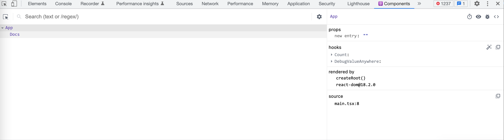
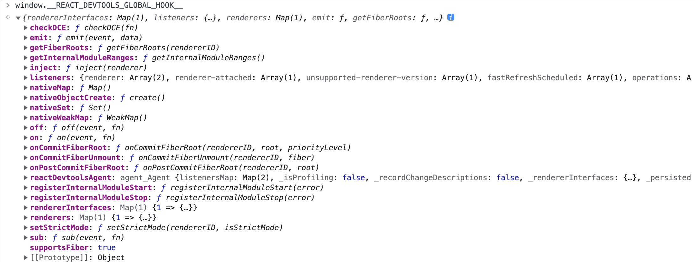
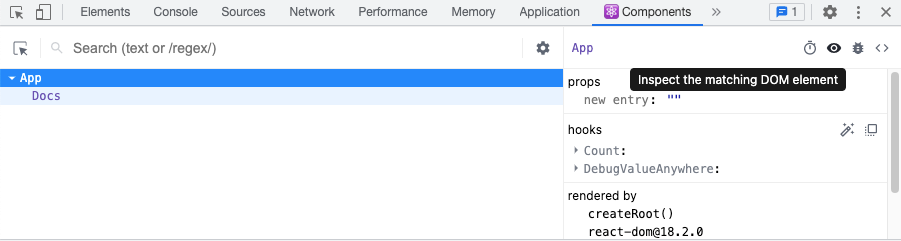

# 发掘 ReactDOM 中的一些隐藏特性

有过 React 经验的开发者可能都使用过 [React DevTools](https://chrome.google.com/webstore/detail/react-developer-tools/fmkadmapgofadopljbjfkapdkoienihi)。DevTools 提供了丰富的能力：展示组件树，组件的 props 与组件中 hook 的值。React Devtools 是如何检测当前网页是否使用 React 以及是如何获取组件相关的众多数据呢？



## React Devtools 的原理

打开 [ReactDOM](https://cdn.jsdelivr.net/npm/react-dom@17.0.1/umd/react-dom.development.js) 代码时，用 `devtools` 为关键字搜索，你会发现许多与 React Devtools 相关的代码。

```js
function injectInternals(internals) {
  if (typeof __REACT_DEVTOOLS_GLOBAL_HOOK__ === 'undefined') {
    // No DevTools
    return false;
  }
  var hook = __REACT_DEVTOOLS_GLOBAL_HOOK__;
  try {
    rendererID = hook.inject(internals); // We have successfully injected, so now it is safe to set up hooks.
    injectedHook = hook;
  } catch (err) {
    // ...
  } // DevTools exists
}
```

在浏览器控制台输入 `__REACT_DEVTOOLS_GLOBAL_HOOK__` 详细看一下这个对象。



这个对象十分复杂，以下的几个方法倒是很值得关注。

- onCommitFiberRoot
- onCommitFiberUnmount
- onPostCommitFiberRoot

### 渲染阶段

从名称来看，上面这几个方法与 ReactDOM 的渲染密切相关了。ReactDOM 在特定的阶段会调用这些的方法，比如：`onCommitFiberRoot`。

```js
function onCommitRoot(root, priorityLevel) {
  if (injectedHook && typeof injectedHook.onCommitFiberRoot === 'function') {
    try {
      // ...
      injectedHook.onCommitFiberRoot(rendererID, root, priorityLevel, didError);
    } catch (err) {}
  }
}
```

正是借助 `__REACT_DEVTOOLS_GLOBAL_HOOK__`， React Devtools 便与 ReactDOM 建立起了联系，从而拥有获取组件众多信息的能力。

### FiberRoot/FiberNode

在新的 React 架构下，会先把 Virtual DOM 转成 FiberNode，然后再渲染 FiberNode。`onCommitFiberRoot` 等这些方法中的传递的数据正是 FiberNode。FiberNode 的结构是比较复杂的，可以简化为如下的结构：

```ts
interface ReactFiberRootNode {
  current: ReactFiberNode;
}

interface ReactFiberNode {
  tag: number;
  stateNode: null | HTMLElement; // dom 节点
  memoizedProps?: Record<string, any>; // props
  memoizedState: ClassComponentState | HookLinkedQueue | null; // hooks

  child?: ReactFiberNode;
  sibling?: ReactFiberNode;
  return: ReactFiberNode; // parent
  // ...
}
```

从上面的结构可以看出，FiberNode 包含了非常多与组件相关的信息。`stateNode` 为组件对应真实的 DOM 节点，`memoizedProps` 为组件的 `props`。当组件为函数式组件时，`tag` 为 0，`memoizedState` 保存了组件中的 hooks 信息。当组件为类组件是，`tag` 为 1，`memoizedState` 则是组件的 `state`。

如下图所示，FiberNode 节点形成一个链表结构。


只要能获取组件对应的 FiberNode，我们便可以做到在运行期间以无侵入的方法获取组件的众多信息。比如：通过 FiberNode 进行遍历，实现 `findNativeNodesForFiber` 方法，用以查到找 其对应的真实 DOM 节点。

```ts
function findNativeNodesForFiber(node?: ReactFiberNode) {
  // ...
  // 先遍历 child
  const { child } = node;
  collectStateNode();

  // 再遍历所有的 sibling
  let current = child?.sibling;
  while (current) {
    collectStateNode();
    current = current.sibling;
  }
  // ...
}
```

React Devtools 中审查元素功能正是基于类似的原理去实现。



### memoizedState 与 React Hooks

上文中提到当组件为函数式组件时，`memoizedState` 保存了 React Hooks 相关的信息。与 FiberNode 类似，React Hooks 也形成一个链表。

```ts
export interface HookLinkedQueue {
  memoizedState: any; // 渲染时的值
  next: HookLinkedQueue | null;
  // ...
}
```

React Hook 将其数据都保存在 `memoizedState` 上。比如对于 `useRef` 来说，`ref.current` 值就是 `memoizedState`。类似的，可以实现 `inspectSomeHooksOfFiber` 来获取组件内使用特定 hook 中保存的值。

```ts
function inspectRefHooksOfFiber(node: ReactFiberNode) {
  let current: HookLinkedQueue | null = node.memoizedState;
  while (current) {
    retrieveValue(current);
    current = current.next;
  }
}
```

## 实践：突破 useDebugValue 的限制

[useDebugValue](https://zh-hans.reactjs.org/docs/hooks-reference.html#usedebugvalue) 是 React 内置的一个 hook，用以在 React Devtools 中显示自定义 hook 的标签。它的限制是只能在 **hook** 中使用。借助前文介绍的知识点，我们可以实现一个增加版的 `useDebugValue`，你可以像普通的 hook 一样来使用它，没有其他限制。

### useDebugValueAnywhere 的实现

`useDebugValueAnywhere` 实现比较简单，`name` 表明数据的名称，用一个特殊的 ref 对象来存储 debug 相关的数据。

```ts
export function useDebugValueAnywhere(name: string, data: any) {
  const ref = useRef({
    [DebugHookKey]: {
      name,
      data,
    },
  });
  // ...
}
```

### 特定的 devtools

参考 React Devtools 的逻辑，在 `__REACT_DEVTOOLS_GLOBAL_HOOK__` 中注入我们的 `onCommitFiberRoot` 方法，从而确保 ReactDOM 每次渲染时，能获取最新的 FiberNode。

```js
currentHook.onCommitFiberRoot = function (...args) {
  handleCommitFiberRoot(...args); // 注入
  oldOnCommitFiberRoot.apply(this, args);
};
```

接下来便是对 FiberNode 进行遍历。在遍历的过程中，检查每个 FiberNode 中 `memoizedState` 链表，检测组件的 hooks 中是否用到了 `useDebugValueAnywhere`。如果存在，就将值 FiberNode 与 hook 中的值保存起来。

```ts
{
  visitFiberNode(node?: ReactFiberNode) {
    if (!node) return;
    this.inspectFiber(node);

    this.visitFiberNode(node.child);

    let { sibling } = node;
    while (sibling) {
      this.visitFiberNode(sibling);
      sibling = sibling.sibling;
    }
  }
}
```

剩下的工作就是考虑以何种形式去展示收集到的 debug 信息。在 PC 端可以直接输出数据到控制台；在移动端 vConsole 使用较多，那么就可以基于 vConsole 开发一个插件，实现一个极简版的 React Devtools，专门用以展示这些信息。

## 总结

本文剖析了 React Devtools 的原理，介绍隐藏在 ReactDOM 中的一些特性，并带领大家熟悉了一下 React Fiber 架构。基于上述原理，可以开发一个增加版的 `useDebugValue`。由于本文介绍的特性并非公开的 API，没有兼容性。当 React/ReactDOM 版本升级时，还需要再做适配，因此只适合用来开发 Devtools 之类的工具，不推荐业务开发使用。
